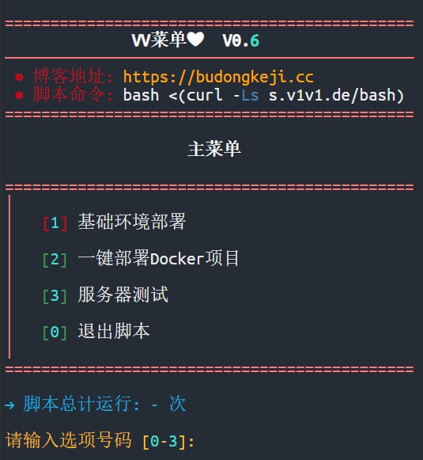
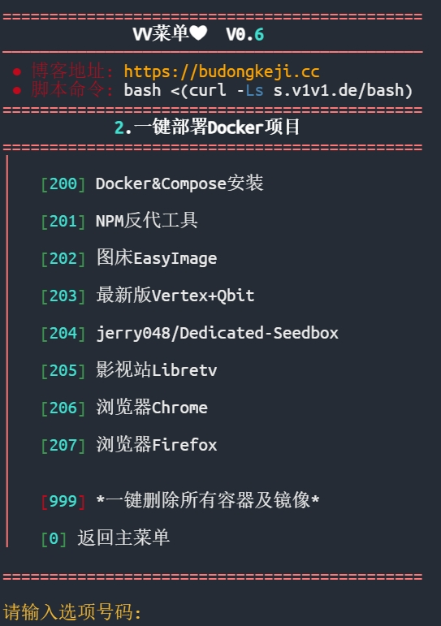
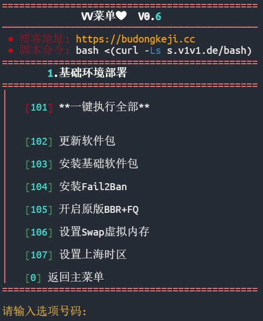
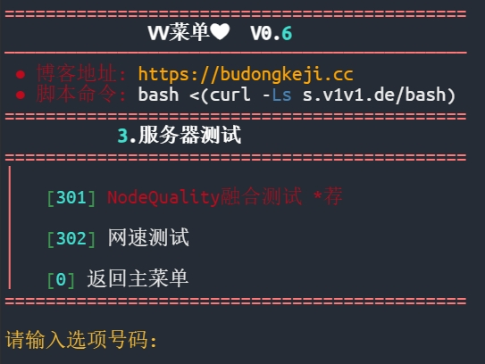

<h1 align="center">
 
 
  Vmenu
</h1>
<h5 align="center">
A lightweight bash script designed to simplify VPS management by automating environment setup, installing popular Docker applications, and integrating server testing tools for performance and network benchmarking.
</h5>

<h1 align="center">🚧 Work in Progress</h1>

### Use it
```bash
bash <(curl -Ls s.v1v1.de/bash)
```

---

### Preview

<div align="center">
<table>
  <tr>
    <td align="center"><strong>Main Menu</strong></td>
    <td align="center"><strong>Docker Menu</strong></td>
    <td align="center"><strong>New VPS Setup</strong></td>
    <td align="center"><strong>Testing Tools</strong></td>
  </tr>
  <tr>
    <td align="center"></td>
    <td align="center"></td>
    <td align="center"></td>
    <td align="center"></td>
  </tr>
</table>
</div>


### Features
- **One-Click Environment Setup**: One-click configures a basic VPS environment automatically (e.g., updates, essential packages).
- **Docker Integration**: Installs Docker and popular containers (e.g., Nginx, Chrome) with minimal setup.
- **Server Testing**: Integrates [Speedtest](https://github.com/sivel/speedtest-cli), [NodeQuality](https://github.com/LloydAsp/NodeQuality), balabalabala...
- **Lightweight & Customizable**: Minimal dependencies, easy to use.

### Functionality Showcase
- **1. Environment Setup**

### Notes
- The script is tested on Debian 12. Compatibility with other distros may vary.

### Contributing
Contributions are welcome!
1. Fork the repository.
2. Create a new branch (`git checkout -b feature/your-feature`).
3. Commit your changes (`git commit -m "Add your feature"`).
4. Push to the branch (`git push origin feature/your-feature`).
5. Open a Pull Request.


### Acknowledgements
- [Speedtest](https://github.com/sivel/speedtest-cli)
- [NodeQuality](https://github.com/LloydAsp/NodeQuality)

### Project Stats


---

**License**

This project is licensed under the [MIT License](LICENSE), allowing free use, modification, and distribution with proper attribution.

**Contact**

For issues or suggestions, open an issue on GitHub or reach out via email: budongkejivivi@gmail.com

<div align="center"> <strong>Made with ❤️ by <a href="https://github.com/vivibudong">Vivi不懂</a></strong> </div>

